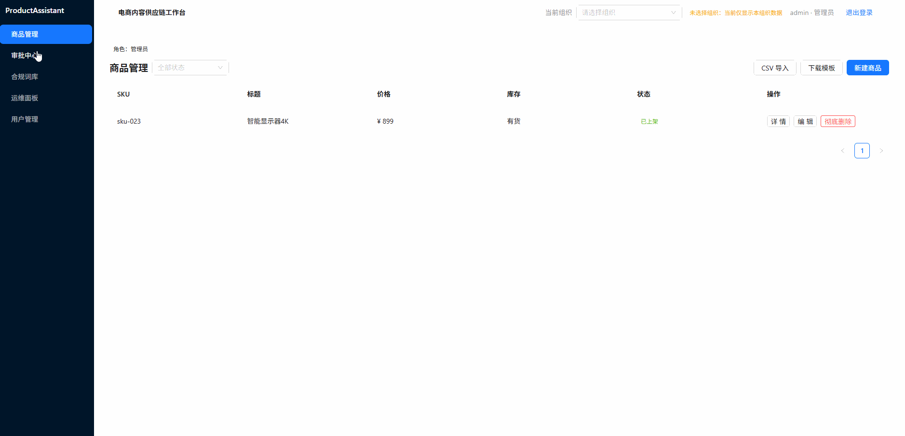
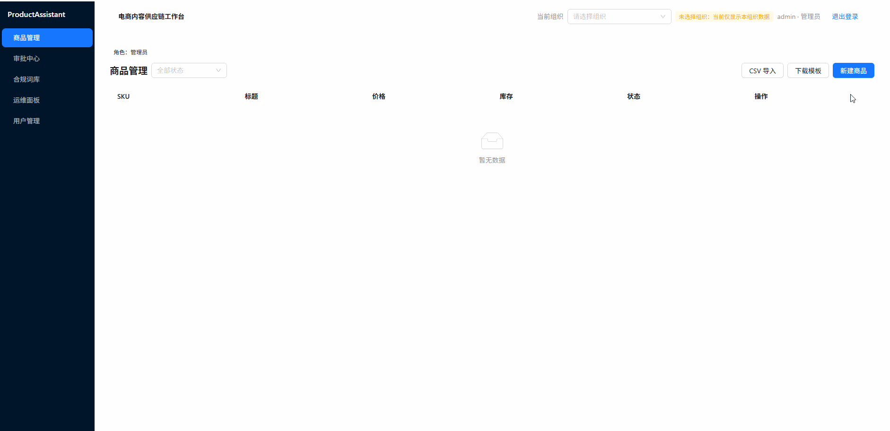
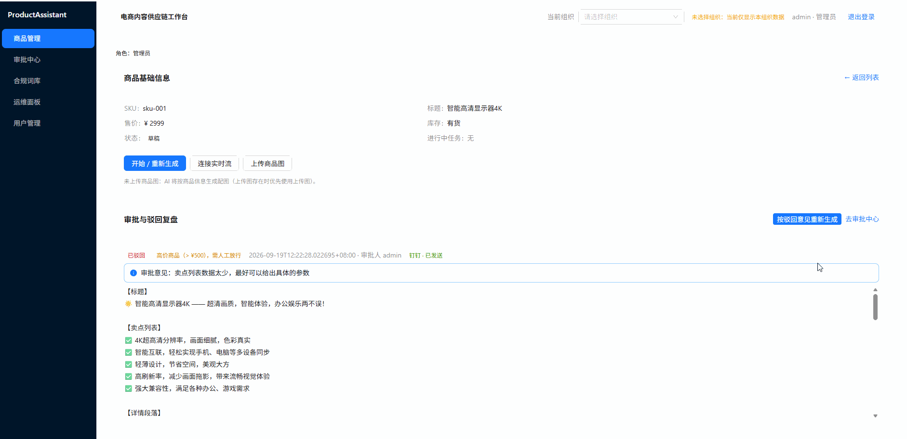
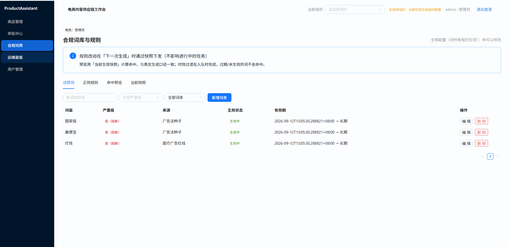
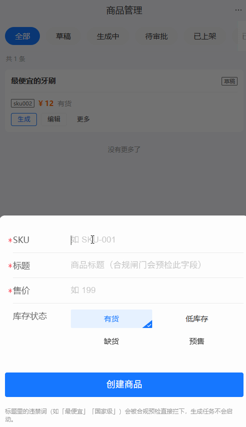
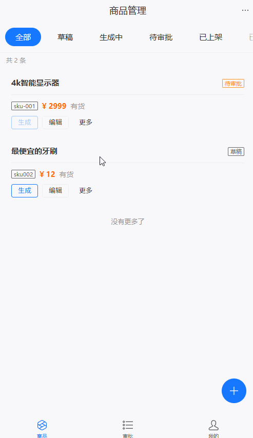
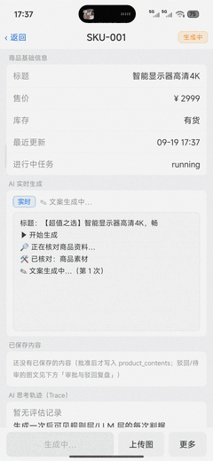

# ProductAssistant — an AI copilot for product listings

> **A B2B copywriting workbench for e-commerce listings**: AI generation → rule and model dual evaluation → human-in-the-loop final approval → published to the catalog.
> It ships three clients — a PC web console, a mobile H5 app and a React Native app — plus a static portfolio landing page.
>
> This is the **public architecture document** (English edition) and it covers **features and core design only**:
> what each module solves, where the boundaries are drawn, where the complexity lives, and how the technology choices trade off.
> 🌐 English | [中文](README.md)

## Contents

| Chapter | What it covers |
|---|---|
| [1. Introduction](#1-introduction) | Business loop, roles and multi-tenancy, client forms, technology choices |
| [2. Design Principles](#2-design-principles) | Five modules and their dependency rules, hexagonal architecture, contract-first, data isolation |
| [3. GIF Previews](#3-gif-previews) | 7 clips of the three clients actually running |
| [4. Orchestration Logic (AI Engine)](#4-orchestration-logic-ai-engine) | LangGraph orchestration, three job paths, event bus, HITL + DingTalk approval, read-only research agent |
| [5. Backend Logic](#5-backend-logic) | Single-writer state machines, live SSE progress, background tasks, idempotency hardening |
| [6. Frontend Logic](#6-frontend-logic) | Desktop console, shared contract core, SSE semantics traps |
| [7. Mobile Logic](#7-mobile-logic) | H5 versus native trade-offs, platform ports, three-client consistency |
| [8. Deployment Logic](#8-deployment-logic) | Layered deployment, image pipeline, CI/CD, queue-grade Redis |
| [9. Database Logic](#9-database-logic) | Two schemas / four roles, privilege matrix, vector store, test coverage |

---

## 1. Introduction

### 1.1 What problem it solves

Listing one product on a marketplace means writing a title, selling points and a detail page, checking every
line against advertising law and platform rules, and then going through a round of approval. Four pain points
shaped this project:

| Pain point | How it is addressed |
|---|---|
| Low copy throughput, unstable style | AI generation, referenced against **semantic recall of past high-converting copy** (RAG few-shot) |
| The model **invents** prices / stock / qualifications | A **read-only research agent** runs before generation and calibrates the "facts" against the real database |
| Compliance review is manual, and a miss is expensive | A double gate — "deterministic rule engine + LLM semantic evaluation"; a rule hit fails fast and skips the model |
| Approval is disconnected from generation (nobody can say who changed what) | A state-machine loop of generate → evaluate → human approval, with replayable events and an approval audit trail |

In one sentence: generation is built as an **observable, interruptible, traceable** pipeline（ https://www.seektruth.org.cn/welcome/ ）, not a chat box.

### 1.2 Business view of one full flow

```text
Operator clicks "Generate" on Web / H5 / App
   │
   ▼
backend: create job + freeze compliance-rule snapshot + publish job:generate (Redis Streams)
   │
   ▼
ai-engine: rag_retrieve → agent_research(read-only research) → generate(streaming) → evaluate(rules + LLM)
   │                                   ├─ passed & low price ─────► image → save_content
   │                                   ├─ failed, under quota ────► generate (Reflection rewrite)
   │                                   └─ failed over quota / high price ─► image → hitl (suspend for a human)
   │
   ├─ progress events evt:{thread_id} ──► backend SSE ──► the three clients (typewriter / stage / image ready / terminal)
   └─ terminal result result:workflow ──► backend consumer advances products.status, opens an approval, sends a notification
                                        │
                                        ▼
                     Human (approval centre) approves / rejects ──► job:approval ──► ai-engine resumes the graph
                                                          └─► persist and publish / close as rejected
```

### 1.3 Roles, multi-tenancy and state machines

| Item | Design |
|---|---|
| Roles | `admin` (organization, members, compliance word lists/rules, read-only ops surface) · `reviewer` (approval) · `operator` (create products, trigger generation) |
| Platform superuser | `sys_users.is_superuser`: after login an "organization picker" appears in the top bar, and whichever tenant is picked is the tenant being operated on (through the `X-Org-Id` header) |
| Multi-tenancy | Apart from the compliance word lists/rules (**global configuration**, deliberately without `org_id`), every business table carries `org_id`; an authorization violation and a missing row **both return 404** |
| Product state machine | `draft → generating → waiting_approval → published`; a rejection or a failure falls back to `draft` |
| Job state machine | `generation_jobs`: `running → succeeded / waiting_input / failed`; jobs that never reach a terminal state are reclaimed by the reaper |
| Who may write state | **backend only**. ai-engine publishes terminal results; the right to advance state is never handed to the AI layer (red line, see chapter 5) |

### 1.4 Four front-end artifacts (three app forms + one landing page)

| Artifact | Form | Role | Key trade-off |
|---|---|---|---|
| `frontend/` | PC web console | The main workspace for operators / reviewers: 8 routes; the detail page has a typewriter, an agent trace and a rejection review | Talks to `/api/v1` only, never reaches across to ai-engine / PG |
| `mobile-h5/` | Mobile H5 | Mostly approvals and light operations, usable in any browser with no install | **Shares the contract core layer** with the desktop console; each page shell is written separately |
| `mobile-rn/` | Native app (iOS + Android) | One codebase for both platforms; its 6 screens are **matched line by line** with H5 | Platform ports in the shared layer carry the 6 platform differences; the UI is hand-rolled with zero UI dependencies |
| `portfolio/` | Static portfolio landing page | Demos of all three clients (7 GIF clips) + project gallery + contact; **switchable between Chinese and English** (a toggle in the top-right corner) | No backend dependency, deployable on its own; its lifecycle differs from the product front ends, so it is a module of its own |

### 1.5 Technology choices at a glance

| Layer | Choice | Why |
|---|---|---|
| Orchestration | Python + **LangGraph** (StateGraph + PostgresSaver) | "Interruptible / resumable human approval" needs persistent graph state, and `interrupt`/`resume` are native capabilities — far more reliable than a hand-written state machine |
| AI gateway | Zhipu GLM (text / image generation / embedding), OpenAI-compatible protocol | function calling follows the standard `tools` protocol, so adding the agent costs **zero new dependencies** |
| Business API | **FastAPI** + async SQLAlchemy + Pydantic | Async is a prerequisite for long-lived SSE connections; Pydantic doubles as contract validation |
| Desktop front end | React 19 + TypeScript + **Vite 8** + Ant Design 6 + Zustand + React Query v5 | One TypeScript contract layer shared by all three clients; antd covers heavy back-office interactions |
| Mobile | antd-mobile (H5) · React Native + Expo (native) | One shared contract core layer, two rendering stacks, each optimal for its platform |
| Storage | PostgreSQL 17 (2 schemas / 4 roles) · Redis Streams (jobs and events) · Milvus (vectors) · OSS (images) | The AI layer and the business layer are **physically isolated inside the database** (see chapter 9) |
| Deployment | Docker Compose + two-layer nginx + Alibaba Cloud ACR + GitHub Actions | Runs on a single 2 vCPU / 2 GB box; images are built in CI and merely pulled on the server |

### 1.6 Status and known limits

| Phase | Scope |
|---|---|
| P0~P6 | Contract freeze, backend skeleton and authentication, product CRUD with hard delete, generation loop with approval CAS, SSE, compliance word lists and the read-only ops surface |
| P7~P11 | PC console, two-layer nginx production setup + CI/CD, mobile H5, native app, portfolio landing page |
| Known limits | Compliance decisions for real marketplaces (Taobao / JD / Pinduoduo) are not integrated yet |
| Test coverage | Database 102 cases · backend 194 · ai-engine 239 · four front ends with their own suites (desktop 92 / H5 24 / native 66 / portfolio 82) |

---

## 2. Design Principles

### 2.1 Five modules and their dependency direction

```text
backend (business API)   frontend (PC)   mobile-h5   mobile-rn      portfolio (static)
      │                     │              │           │                │
      │                     └──────────────┴───────────┘                │  /api/v1 only
      │                        (shares the @pa/core contract layer)     └─► no backend
      ▼
   Redis Streams (the only business channel between backend ↔ ai-engine)
      │
      ▼
ai-engine (AI orchestration) ──► reads business tables; never writes products.status
      │
      ▼
database (2 SCHEMA / 4 ROLE)         infra (containers / nginx / CI)
```

Three hard red lines (each locked by tests):

1. **frontend talks to backend and to nothing else** — never straight to ai-engine; backend and ai-engine **communicate only over Redis Streams**.
2. **ai-engine cannot operate backend's tables directly**: physically it has no privilege to (role matrix + negative assertion tests).
3. **the product state machine is written by backend only**: the AI layer can only publish terminal results, and a backend consumer advances state.

### 2.2 Hexagonal (ports and adapters) architecture

ai-engine is where this principle is applied most thoroughly: `ports/` (13 outbound abstractions) contains only
`abc` and the standard library and **no implementation at all**; `adapters/` holds the implementations
(PG / Redis / Zhipu / OSS / Milvus / Pillow / rule engine) and **never imports the core**.
The payoff is "swap the implementation without touching the core".

| Layer | Purpose | May import | Red line |
|---|---|---|---|
| `service/` inbound process | consume jobs, wire ports, drive/resume the graph, publish terminal results | everything | no HTTP routes, no auth; never writes `schema_pa_backend` |
| `workflowcore/graph` | build the graph (nodes + conditional edges + checkpointer factory) | core + ports + langgraph | never imports adapters; no direct DB/Redis access |
| `workflowcore/node` | pure functions: read State, return a delta | ports + state | **no direct DB/Redis/HTTP access**; only `node_hitl` may call `interrupt()` |
| `workflowcore/agent` | agent subgraph + middleware + tool registry | ports + langgraph | offers no **write** tool; artifacts only ever land in State |
| `ports/` | outbound abstractions (interface + contract + constants) | the standard library only | contains no implementation |
| `adapters/` | port implementations | ports + third-party libraries | never imports the core |

### 2.3 Contract-first: the two sides share no code

The Python side (ai-engine) and the TypeScript side (the three front ends) cannot share code, so **the contract is the
single source of truth**, locked from both ends by "contract complement points + tests":

| # | Fact | What the other side does |
|---|---|---|
| 1 | ai-engine's rule snapshot **does no time filtering** | filtering by validity window happens **at enqueue time** (backend's `build_rules_snapshot`) |
| 2 | the canonical shape of `raw_images` is `list[str]` | writes normalise immediately; the response layer still accepts the historical `[{url:…}]` shape |
| 3 | purge is guarded by "the product row still exists → abort the cleanup" | hard delete must publish purge only **after the physical delete + commit** |
| 4 | purge only removes images that belong to AI-side content | uploaded originals are deleted by backend itself (`img/pa/` allow-list) |
| 5 | compliance matching semantics (longest match → drop overlaps left-first → stable sort) | the preview matcher is aligned case by case; consistency is locked by tests |
| 6 | a broken regex is **silently skipped** on the AI side | regex syntax is validated at rule-creation time, so "configured but never matching" is blocked before it reaches the database |

### 2.4 Single-source-of-truth checklist

- `frontend/src/services/streamLabels.ts`: one **shared** event renderer for all three clients
- `portfolio/src/data/projects.ts`: all portfolio content + entry links; a test does **"declare, then verify"**
  (every GIF written into the data must really exist). The Chinese and English sets (`projects.ts` +
  `projects.en.ts`) and the UI copy dictionary (`strings.ts`) are kept **structurally aligned by the same
  kind of gate** (item-by-item comparison + no Chinese characters may be left on the English page).
- `state/schemas.py` in ai-engine: the single source of truth for the JSON Schema of LLM structured output.
- `ports/event_bus.py` in ai-engine: every outbound message envelope carries `schema_version` (injected in one place).
- `infra/.env.template`: the **single key list** for environment variables; a script keeps `.env` and the template in
  sync (idempotent append, never overwriting an existing value).

### 2.5 Data isolation: 2 SCHEMA / 4 ROLE (details in chapter 9)

- `schema_pa_backend`: the business namespace (organizations / sys_users / products / hitl_approvals /
  compliance_words / compliance_rules / generation_jobs / notification_outbox / delete_audits).
- `schema_pa_ai`: the AI namespace (product_contents / evaluation_logs / the four LangGraph checkpoint tables).
- Four roles: `role_pa_admin` (DDL) · `role_pa_backend` (business DML) · `role_pa_ai` (AI DML + read-only business) ·
  `role_pa_ai_setup` (creates the checkpoint tables only).
- The effect: **even when the AI-side code is wrong it cannot write business tables** (guarded by negative assertion tests).

---

## 3. GIF Previews

Every clip comes from an interface that was **really running** (real backend + real model calls + a real Redis event
stream), recorded and re-encoded to GIF, then optimised losslessly (`gifsicle -O3`). Assets live under
`portfolio/public/demos/pa/<platform>/` by convention.

### 3.1 PC web console (4 clips)

| Product list (status badges / filters) | Trigger generation (typewriter + stage hints) |
|---|---|
|  |  |

| Evaluation failed → Reflection rewrite | Compliance blocked on input (cannot generate) |
|---|---|
|  |  |

### 3.2 Mobile H5 (2 clips)

| Trigger generation on mobile | Approval (approve / reject + deep link) |
|---|---|
|  |  |

### 3.3 React Native app (1 clip)

| One codebase for iOS + Android: overview |
|---|
|  |

---

## 4. Orchestration Logic (AI Engine)

### 4.1 Scope

A pure AI engine layer: **no HTTP routes and no authentication** (decoupled from the language and feature layers).
It does exactly three things:

1. consume the Redis Streams jobs published by backend (`job:generate` / `job:approval` / `job:product_purge`);
2. drive `ListingWorkflow` (generate → evaluate → HITL human intervention → persist / reject), publishing the copy and image artifacts plus stage events back to `evt:{thread_id}`;
3. publish the terminal result to `result:workflow`, where backend advances the product state.

### 4.2 Graph orchestration (LangGraph StateGraph)

```text
START → rag_retrieve → agent_research(optional enhancement) → generate → evaluate
                                                    ├─ persist(passed & low price) → image_then_save → save_content → END
                                                    ├─ retry(failed, under quota)  → generate (rewrite with the last evaluation)
                                                    └─ human(failed over quota / high price) → image_then_human → hitl ─┬─ approve → save_content → END
                                                                                                                      └─ reject  → reject_end  → END
```

Key design points:

- **At runtime it is the LangGraph engine that schedules nodes**: `workflow.py` contains not a single `node.xxx()`
  call; it only binds "node function + ports" into callables with `functools.partial`, registers them, and connects
  the edges. So "wiring time (who constructs whom)" and "runtime (who calls whom)" must be read separately.
- **Every node is a pure function**: it reads State and returns a delta dict; all business logic lives in the nodes,
  all IO lives behind ports.
- **The `image` node is registered twice** (`image_then_save` / `image_then_human`): the image is ready **before**
  entering HITL, so when `interrupt()` suspends the run the `content_snapshot` already holds the complete copy plus
  image — **what the approver sees is what gets published**.
- **HITL rests on checkpoints, not memory**: `node_hitl.interrupt()` suspends and `Command(resume=…)` resumes after
  approval; on resume the graph instance is **newly created** and reads state back from the checkpoint by
  `thread_id` (across messages / processes / instances).
- **Conditional edges are pure functions** (State in, decision out): `should_retry_or_human` chooses
  `retry / persist / human`; the "high price" threshold (500) routes to a human — cost and risk are modelled
  explicitly in the topology rather than being left to prompt wording.

### 4.3 Why the three job paths must be designed separately

| Path | Semantics | Where the complexity lives |
|---|---|---|
| ① `job:generate` | Generate the copy and image for a product from scratch | The longest path: several nodes + conditional edges + Reflection rewrite + streaming events |
| ② `job:approval` | Resume one suspended generation **across messages / processes / graph instances** | Distributed lock + checkpoint resume + "a rejection still needs a terminal event" |
| ③ `job:product_purge` | Physical cleanup after a product is hard-deleted | **Ordered upfront collection**: once the row is gone, the URLs and the thread_id are unrecoverable |

Constraints:

- ③ has an **upfront guard**: a product row that still exists means an orphan purge message (the delete never took
  effect) → abort and ack, so valid data is never deleted by accident.
- ③ is ordered: "collect image URLs and reverse-look-up the thread_id first" → then delete content and evaluation
  logs → clear the three checkpoint tables → delete the allow-listed OSS objects → delete vectors; 3 of those steps
  are best-effort (a failure is logged and never blocks the ack), and the job is idempotent and re-publishable.
- ② serialises resumes with `lock:{thread_id}` (`SET NX EX` + Lua CAS release): an instance that cannot take the lock
  **skips that message** (returning `busy`); two instances must never resume the same thread at once, and the lock is
  released **before** the ack (so a throwing ack cannot leave the lock stuck until its TTL).
- **No side effects before `interrupt()`**: a resume re-executes the whole `node_hitl` function once.
- Path ②'s graph **carries no rule snapshot** — harmless today (a resume only walks forward from `hitl`, and the
  later nodes do not use the rule engine); but if the post-resume path is ever wired back into `evaluate`, the
  snapshot must be passed along. Points like this — "fine now, a trap later" — all carry an explicit comment in the code.

### 4.4 Event bus: two outbound keys with different purposes

| Outbound key | Payload | Consumer | Semantics |
|---|---|---|---|
| `evt:{thread_id}` | progress events + terminal events | the backend SSE endpoint → the three clients | **the only source for live progress in the UI** (typewriter / stage / image ready); `MAXLEN 2000` + TTL 7 days |
| `result:workflow` | the graph's terminal result | backend's `WorkflowResultConsumer` | **drives the product state machine** (published / awaiting_human / rejected / failed); the content snapshot is carried only when a human is needed |
| `lock:{thread_id}` | a mutual-exclusion token | worker ↔ worker | serialises approval resumes |

Event types on `evt` (in the order they appear along a flow): `generate.started` · `stage.researching` · `agent.tool` ·
`agent.done` · `stage.generating` · `content.chunk` · `stage.evaluating` · `evaluate.result` ·
`stage.imaging` · `image.ready` · `done` · `hitl.waiting` · `approval.resumed` · `rejected` · `failed`.

> **The UI renders business language only**: implementation details such as `stop_reason` / `turns` / `tool_calls` /
> internal tool names / `score=` / `source=uploaded` are **never rendered**; they stay in the payload for debugging.

### 4.5 Up to 6 model calls per job

| # | Trigger | Note |
|---|---|---|
| ① | `rag_retrieve` recall scoring | vectorising the copy (embedding) |
| ② | `agent_research` multi-turn data gathering | function calling over read-only tools |
| ③ | `generate` streaming the copy | **the only source of body text** for the typewriter |
| ④ | `evaluate` structured evaluation | hard JSON Schema constraints + feeding failures back for repair |
| ⑤ | `image_*` image generation | CogView (including downloading the image) |
| ⑥ | `save_content` finalising into the vector store | so that later products can recall it as a similar sample |

**Graceful degradation runs through the whole design**: a missing config → the factory returns `None` → the node
degrades on its own (deterministic mock copy / skip writing vectors / text-only when there is no image), and it
**never blocks start-up and never blocks front-end rendering, which keeps the user experience intact**.
Every kind of degradation therefore leaves an explicit trace (a start-up self-check + one result line per generation +
the event payload).

Three **independent** quotas (they must be counted separately when costing a job; taking the `retry` edge makes ③④ run again):

| Quota | Default | On exhaustion |
|---|---|---|
| Reflection retries (evaluation failed → rewrite) | 2 | the conditional edge routes to a human (HITL) |
| JSON structure repairs (output violates the contract) | 2 (at most 3 calls) | safe degradation `passed=False, score=0`, reason written to `last_eval_errors` |
| Agent budget (model turns / tool calls) | 2 / 3 | the middleware cancels before the next turn and converges on the evidence it already has |

### 4.6 Read-only research agent

Between `rag_retrieve` and `generate` sits the `agent_research` node: it uses function calling over **read-only tools**
to check real material and historical records, writes its conclusions into `agent_context`, and the generation prompt
carries them in as "facts".

| Problem it solves | How | Tool |
|---|---|---|
| The model hallucinates prices / stock / qualifications | it really reads the product table; a miss returns `{"found": false}` (**forcing the model to say "not found" instead of inventing**) | `get_product_facts` |
| The same banned word keeps coming back | pull the violations from past evaluations + self-check before writing | `get_eval_history` / `scan_compliance` |
| The same rejection reason keeps coming back | pull past rejection comments | `get_approval_history` |
| The copy does not sound like this shop's high-converting style | semantically recall this tenant's past copy fragments | `retrieve_similar_copy` |
| "Why did it write it that way?" cannot be answered | a per-turn audit trace + live events (rendered in real time in the UI) | `agent_trace` + `agent.tool` |

Red lines and boundaries:

- **No write tool is ever registered**; artifacts only go into State — they are **never persisted and never advance the product state**.
- **Tenant fields are fixed by a closure** (`org_id` / `product_id` **never appear in a tool's parameter schema**), so
  the model has **nowhere** to put a cross-tenant parameter; a red-line assertion test guards this. That is far more
  reliable than "asking the prompt not to overreach".
- **Tools are trimmed dynamically by the ports that exist**: with Milvus unconfigured, `retrieve_similar_copy` is not
  registered, which avoids a hallucinated entry point that would always return nothing.
- **Degradation red lines**: with no runtime injected the node is a no-op (behaviour identical to before the agent was
  wired in); an LLM / network failure converges to `stop_reason=runtime_error` **without raising**; a failed research
  run **never** marks the product failed (research is an **enhancement, not a requirement**).
- **Three middleware policies**: a model-call cap (budget circuit breaker) / a tool-call cap / retry fallbacks for
  read-only tools; `wrap_tool_call` nests **in reverse order** (first in the list = outermost). There is **no separate
  switch** — stopping it means turning the whole agent off.
- The subgraph **attaches no checkpointer**: that keeps the inner round trips out of the **generation thread's**
  checkpoint, which would otherwise break the interrupt/resume semantics of HITL.

**On by default, and reversible**: an unset `AI_ENGINE_AGENT_ENABLED` counts as on — because calibrating facts against
real material / past violations / approval comments should be the **default quality floor**, not a luxury for a few scenarios.

### 4.7 Checkpointing in production (the base for HITL)

| Step | Role | Note |
|---|---|---|
| Table creation (idempotent, one-off) | `role_pa_ai_setup` | `PostgresSaver.setup()` creates `checkpoints` / `checkpoint_blobs` / `checkpoint_writes` / `checkpoint_migrations` |
| Runtime read/write | `role_pa_ai` | `PostgresSaver` + a psycopg connection pool (**process-level singleton** inside the worker, created lazily, released on shutdown) |

- **A one-off `SET search_path` does not survive pooling** (a new connection falls back to `public`) → it is pinned in
  the connection factory: `options="-c search_path=…"`, `autocommit=True`, `row_factory=dict_row`,
  `prepare_threshold=0` (compatible with PgBouncer's transaction pooling).
- **Self-healing**: pool liveness checks let a bad connection be rebuilt before it is handed out, so a HITL resume does
  not fail forever after a PG restart or a network blip (a bare connection has no such ability).
- **Automatic grants**: `ALTER DEFAULT PRIVILEGES` makes the checkpoint tables created by the setup role **automatically**
  granted to the runtime role, so "create tables" and "run" can be split across roles with no follow-up GRANT.
- **Deserialisation safety**: `LANGGRAPH_STRICT_MSGPACK=true` by default, which narrows the types allowed while
  deserialising checkpoints.

### 4.8 Production reliability hardening (Redis Streams is the only business channel)

Hardened to **queue-grade** standards, and the defaults are production-ready:

| Capability | Key behaviour |
|---|---|
| PEL reclamation | `XAUTOCLAIM` before each consume round reclaims messages idle beyond the threshold; malformed data raises a decoding error that **pinpoints the culprit** (with msg_id and raw payload) |
| Dead-letter queue | Over-limit delivery attempts or an invalid body → move to `dlq:{stream}`; **write the dead letter first, then ack** (if that write fails there is no ack, so no message is ever lost) |
| Poison message vs. slow job | A thread lock still held → **skip reclamation** (protecting legitimately slow jobs); a released lock with the message still unacked is a real poison message |
| Stream retention | evt: `MAXLEN 2000` + TTL 7 days (refreshed on every publish); job / result: `MAXLEN 10000` |
| Idempotency trio | the `done:{thread_id}` terminal marker (**written only for published**) + the per-thread lock + the graph's own checkpoint |
| Observability | `worker:heartbeat:{consumer}` (TTL 30s — an expired key is the "consumption stalled" signal) + a pending count printed every 20 rounds |

> **Where the ack sits decides reliability**: generate / purge ack in a `finally`; approval "releases the lock, then acks".
> When the answer is `busy`, acking is **deliberately** handled case by case: a **newly published** duplicate is acked and
> dropped, whereas a **reclaimed** message that cannot take the lock is **not acked** (the original holder may simply be
> slow, so it is left for the next reclamation round) — reversing this silently drops jobs.
> Parameter tuning, the failure drill list (kill -9 / duplicate delivery / dirty messages / Redis restart / memory pressure) and DLQ handling procedures belong to the operations manual.

---

## 5. Backend Logic

### 5.1 Scope

The business API gateway layer (FastAPI + async SQLAlchemy + PostgreSQL + Redis) with **no AI logic at all**: it does
not call an LLM, does not run LangGraph and does not write ai-engine's business tables (it only reads
`product_contents` / `evaluation_logs`).

- Its one identity: **frontend talks to backend and to nothing else**; backend and ai-engine communicate only over Redis Streams.
- On the database side it connects as `role_pa_backend` only; on `delete_audits` even UPDATE / DELETE are REVOKEd —
  **the audit trail can only be appended to**.
- The product state machine and the job state **are written by backend only**: ai-engine publishes terminal results,
  and a consumer in this module advances them.

### 5.2 Generation loop: ordering is correctness

```text
POST /products/{id}/generate
  → guards (product not deleted/archived and no job in flight, so a double trigger is impossible)
  → create generation_jobs(running) + products.status='generating' + bind active_thread_id
  → freeze the rules snapshot at enqueue time (including the effective_at / expires_at validity window)
  → XADD job:generate only after commit (a publish failure rolls the state back and returns 503; never a stuck 'generating')
  → ai-engine runs the graph → result:workflow → WorkflowResultConsumer:
       published      → products.published       + jobs.succeeded
       awaiting_human → products.waiting_approval + jobs.waiting_input
                        + hitl_approvals(pending, content_snapshot) + notification_outbox
       rejected/failed→ products.draft           + jobs.failed (carrying the failure reason)
POST /approvals/{id}/approve|reject
  → CAS (UPDATE … WHERE status='pending') → commit → XADD job:approval
  → missed-publish fallback: ApprovalRedriveWatchdog (throttled with Redis SETNX) + a manual re-publish endpoint
```

Constraints: **the publish must happen after the commit** (otherwise a consumer may not see the data yet);
**the CAS must include `status='pending'`** (otherwise two approvals can race); and **a re-publish must recognise
"nothing needs publishing"** — resuming an already advanced product is a **silent no-op** (measured: no error, no
re-run, no duplicate write, no flipped decision), so the endpoint must answer `outcome=not_needed` instead of
pretending it succeeded.

### 5.3 Three semantics of the approval domain

| Capability | Contract | Why |
|---|---|---|
| History query | Only an **explicit** `?status=all` skips filtering; omitting it is still equivalent to `pending` | The review page once sent just `product_id` and was silently filtered to `pending`, so **closed rejections could never be found**. Making "all" something you have to state removes the "omitted = all" ambiguity |
| Re-publish | Returns `{needed, outcome, reason}` with `outcome ∈ enqueued / not_needed / throttled / enqueue_failed` | The criteria match the watchdog: a real publish happens only while the product still sits in `waiting_approval`; the throttle key lives 1 hour and **an unavailable Redis lets the call through** (better to publish for real) |
| Override trail | When the content snapshot carries `violations`, `feedback` is **mandatory** (otherwise 422); on success `approval_overrides` is written **in the same transaction** as the decision | After a compliance hit was routed to a human, one click on "approve" could publish with no trace — leaving no way to answer later "who knowingly released which hit?". A human may still override (a business decision), but must leave a reason |

Two **append-only** audit tables support this: `approval_redrive_audits` (re-publish attempts and the latest result)
and `approval_overrides` (who overrode, the hit snapshot, the reason); both are echoed in the list and detail views.

### 5.4 SSE: making progress a first-class citizen

| Step | Design |
|---|---|
| Authentication | `stream-ticket`: a Bearer access token is exchanged for a **short-lived ticket** (120s by default, bound to the product and the org) — EventSource cannot send custom headers, so this is the only correct answer; Bearer is still accepted, which keeps debugging simple |
| Authorization | the ticket and the product's ownership are both checked; an authorization violation and a missing row **both return 404** |
| State gate | Only `generating` / `waiting_approval` replay and follow; any other state receives a single `ready` control frame and the stream closes (so the front end cannot treat a finished job as "generating" and spin) |
| Replay | `Last-Event-ID` resumes the stream (`XRange` with an **exclusive lower bound**, so nothing is sent twice) |
| Following | incremental reads every ~0.25s; **synchronous Redis calls are pushed onto a thread pool** (otherwise they block the event loop) |
| Closing | terminal states close the stream: `done` / `rejected` / `failed` / `hitl.waiting`; an idle close uses the **comment frame** `: stream-idle-close` (the front end reconnects automatically with its `Last-Event-ID`) |

### 5.5 Three background tasks (started with the application lifecycle; disabled in tests)

| Task | Purpose | On failure |
|---|---|---|
| `WorkflowResultConsumer` | consume `result:workflow` and advance the state machine | back off and retry within the round; **the process never exits** |
| `OutboxDeliverer` | deliver approval notifications (outbox → DingTalk / console) | exponential backoff, then `dlq` at the limit; `last_error` **exists only while undelivered** (cleared on delivery), so "it did fail earlier" is read from `retry_count` — otherwise the UI would report a self-healed hiccup as a delivery failure |
| `ApprovalRedriveWatchdog` | re-publish resumes for decisions that never reached the AI layer | as above, plus Redis throttling against duplicate publishing |

Five idempotency / boundary hardenings in the terminal consumer:
**duplicates are treated as "already terminal, skip"** (`duplicate` / `busy` are normal answers, not errors), **CAS
updates**, **`content_snapshot` is carried only when routing to a human**, **the failure reason is written back to the
job row** (the UI shows `input_compliance_blocked(product title): banned word "cheapest"` directly) and
**notifications go through the outbox instead of being sent synchronously**.

### 5.6 Compliance word lists and the ops surface

- Beyond CRUD for word lists / rules there are two extra endpoints, **snapshot** and **preview**: the first returns
  "the rules the next generation will ship with", the second runs a hit preview (position + score + whether it blocks)
  against the current snapshot with the same semantics as enqueueing — it exists to cure "configured but never matching".
- **Only admin may write global configuration**: `compliance_*` carries no `org_id`, so changing one word affects every organization.
- **The ops surface is read-only by default**: heartbeats (including the stalled verdict) / stream lengths and
  consumer-group PELs / DLQ overview / stuck job list; **the only mutating action is "abort a stuck job"**, which
  requires a `reason` and writes a `job_abort_audits` record. The DLQ itself **deliberately offers no one-click re-publish**.
- Three attitudes towards a compliance hit: a hit at the input gate → the job fails and the product returns to `draft`;
  a hit in the body → score penalty + rewrite + human review (a human may override but must leave a reason);
  an advisory-level hit → it takes part in scoring and is handed to the LLM for a second look.

---

## 6. Frontend Logic

### 6.1 Stack and red lines

```text
Stack   : React 19 + TypeScript + Vite 8 + Ant Design 6 + Zustand + React Query v5 + React Router v7
Red line: talks to /api/v1 only (in dev vite proxies to :8000; in production nginx reverse-proxies on the same origin);
          never straight to ai-engine / PG
Routes  : /login · / (products) · /products/:id (detail: typewriter + trace + rejection review)
          · /approvals (+ /approvals/:id?ticket= deep link) · /compliance (word lists / rules / preview / snapshot)
          · /ops (heartbeat / PEL / DLQ, read-only) · /members
```

### 6.2 Contract core layer shared by the three clients

The desktop console and the two mobile clients extract their `api / services / store / types` into `@pa/core` (the source
directory is still `frontend/src/*`), while **each page shell is written separately**: a contract change happens in one
place and all three UIs stay optimal for their own platform.

The price is one discipline: **changing the shared layer means running the test suites of all three clients** (each has
its own script, sharing the same "per-file ✓ plus built-in timeout" closing convention).

### 6.3 Three SSE semantics

Notes for the front end:

1. `hitl.waiting` is a **terminal state** in this project (the server closes the stream right after it) → the front end must **stop reconnecting** and show "routed to human approval";
2. `ready` is a backend **control frame** (no job in flight) → show a hint and stop; do not spin on reconnects;
3. comment frames (`: stream-idle-close` / `: stream-error`) **do not trigger `onmessage`** → they must be told apart at the text level: "idle close (reconnect)" versus "stream read error (limited retries)".

The three clients share one `streamLabels.ts` to render events, locked by tests that use **real event payloads** and
include a negative assertion: the rendered output **must not contain** internal fields such as `stop_reason` / `turns` /
`tool_calls`.

---

## 7. Mobile Logic

### 7.1 Why both H5 and native instead of just one

| Form | Role | Trade-off |
|---|---|---|
| H5 (React + antd-mobile) | a shared link opens it, no install required; mainly approvals and light operations | reuses the desktop contract core layer, the page shells are written separately; same backend origin as the desktop console |
| Native app (React Native + Expo) | one codebase for iOS + Android; needs native capabilities and a steadier on-site presence | its 6 screens are **matched line by line** with H5; the UI is a **hand-rolled thin UI (zero UI dependencies)** |

### 7.2 Platform ports extracted into the shared layer

The 6 points that all three clients (Web / H5 / RN) need but implement differently are extracted into `platform.ts`:
**API base URL / session redirect / expiry event / timers / JWT decoding / SSE and binary transport**.

Precisely because those 6 points are gone, `http.ts` (single-flight token refresh + 401 replay) and `sse.ts`
(`hitl.waiting` terminal / `ready` without reconnecting / the three comment-frame states) can **share one implementation
across all three clients** — otherwise each client would grow its own copy, whose semantics would drift sooner or later.

### 7.3 Implementation conventions on mobile

- layout uses **tables instead of grid layouts** (an information-density trade-off on narrow screens), with key fields in two-column key/value cards;
- image viewing is delegated to the native / browser capability, with no UI library pulled in;
- real-device debugging **needs no CORS**: with the phone and the dev machine on the same subnet, open `http://<LAN IP>:5174` and it goes through vite's `/api` proxy exactly like the desktop console (an extra payoff of "no direct backend access");
- the native client states its **verification boundary** honestly: pinned dependency versions (the Expo SDK / RN version table) and "which interactions were verified on a real device and which only in a simulator" are all itemised, instead of a blanket claim that "both platforms are supported".

### 7.4 What keeps the three clients consistent

1. all of them go through `/api/v1` only and share the same TypeScript types and API client;
2. event rendering shares `streamLabels.ts` (see chapter 6);
3. each client has its own test suite, and **changing the shared layer means running all three**;
4. pages and interactions are **matched item by item** (the screen counts, deep links and state handling of H5 and RN map one to one), and differences are only allowed in those 6 "platform ports".

---

## 8. Deployment Logic

### 8.1 Layering: locally only the database runs on the host

| Layer | Contents | Why |
|---|---|---|
| Host | PostgreSQL 17 | data lives on the local disk: easy GUI access, backups and destructive resets |
| Containers (dev) | Redis / etcd / MinIO / Milvus | heavy dependencies, version-sensitive, and they need "destroy and rebuild in one command"; Milvus depends on the first two being healthy |
| Host processes (dev) | backend / ai-engine / the front-end and mobile dev servers | **hot reload** and breakpoint debugging, which containers cannot match; a readiness probe checks the **real dependency** (the backend's `/readyz` needs both PG and Redis, ai-engine needs a heartbeat key to appear) rather than merely a live process |
| Containers (prod) | nginx(edge) · frontend · mobile-h5 · portfolio · backend-api · ai-engine · redis · (the `rag` profile: etcd / minio / milvus / milvus-init) | isomorphic with dev, which cuts down on "it works locally but not in production" |

The Milvus stack lives behind its own profile: when RAG is not in use there is no reason to pay 2 vCPU / 2 GB for it —
a key trade-off that keeps single-box deployment possible.

### 8.2 Production topology and request routing

- **Two-layer nginx**: the outer `edge` terminates TLS and routes by path — `/` desktop · `/h5` mobile · `/api` backend;
  the static landing page is served separately; **buffering is turned off for the SSE path** (otherwise the typewriter
  degrades into a single big flush).
- The build outputs of the front end and of the landing page are pure static files, so no Node process is needed at runtime.
- **A single egress surface `/api/v1`**: cross-origin concerns and authentication are settled inside the same origin, so
  the front end needs no CORS configuration.

### 8.3 Image pipeline: built in CI, pulled on the server

```text
GitHub Actions
  ├─ matrix build of 5 images: backend / ai-engine / frontend / mobile-h5 / portfolio
  ├─ additionally re-push the third-party base images (nginx / redis / postgres …) into the same registry
  └─ plain docker push to Alibaba Cloud ACR
        ├─ CI pushes through the public domain (the runner is overseas)
        └─ ECS pulls through the VPC domain in the same region (no public traffic charges)
ECS: docker compose pull && up -d → run the acceptance script
```

Notes:

1. **buildx `push: true` cannot be used**: it produces an OCI index / provenance manifest (including `platform=unknown/unknown`) that ACR's personal edition rejects outright (`unknown manifest`) → build locally and use a plain `docker push` instead.
2. **Base images must be re-pushed as well**: ECS cannot reach Docker Hub, and **even with the same image already cached on the host** a `compose pull` still fails.

### 8.4 CI/CD and acceptance checks

| Workflow | Trigger | Contents |
|---|---|---|
| `ci.yml` | PR / push | 4 job groups: backend tests · ai-engine tests · the three front ends (0 type errors + tests + production build) · **environment-variable contract check** |
| `deploy.yml` | main branch / manual | build and push to ACR → SSH to ECS → `compose pull` + `up -d` → run the acceptance script |

**The environment-variable contract check**: `infra/.env.template` is the single key list — a missing key is an ERROR,
an unregistered key or a weak password is a WARN, and in production mode (`--prod`) even a weak password blocks the
build. It moves "we found a missing environment variable after deploying" forward to the PR stage; the price is keeping
one template up to date.

### 8.5 Production Redis is a queue, not a cache

| Item | Setting | Reason |
|---|---|---|
| `maxmemory-policy` | `noeviction` | messages in a queue **must not be evicted at random** |
| Persistence | AOF everysec | the reliability floor for jobs and events |
| Dangerous commands | `FLUSHALL` / `CONFIG` etc. disabled | protection against mistakes |
| Network | **no host port exposed** | reachable only from inside the container network |
| Capacity | `MAXLEN` trimming + TTL | streams cannot grow without bound |

---

## 9. Database Logic

### 9.1 Two schemas: AI and business isolated inside one database

| Schema | Owner | Tables |
|---|---|---|
| `schema_pa_backend` | backend | organizations · sys_users · products · hitl_approvals · compliance_words · compliance_rules · generation_jobs · notification_outbox · delete_audits |
| `schema_pa_ai` | ai-engine | product_contents · evaluation_logs · checkpoints / checkpoint_blobs / checkpoint_writes / checkpoint_migrations |

### 9.2 Least privilege across four roles

| Role | Privileges | Used by |
|---|---|---|
| `role_pa_admin` | everything (DDL) | initialisation / migrations / bootstrapping the superuser |
| `role_pa_backend` | business schema DML | backend at runtime |
| `role_pa_ai` | AI schema DML + business tables **read-only** | ai-engine at runtime (a write to a business table is refused by PostgreSQL, guarded by a negative assertion test) |
| `role_pa_ai_setup` | create the checkpoint tables | table creation only, never used at runtime |

### 9.3 Migrations, seeds and vector collections

`database/sql/` is ordered and idempotent: `0001_schema.sql` (roles + schemas + the full DDL) ·
`0002_roles_grants.sql` (the least-privilege matrix, applied) · `0003_seed.sql` (demo seed for the compliance word lists) ·
`0004_delete_audit.sql` (hard-delete auditing) · later increments (such as `0006_approval_audits.sql`,
`0007_superuser.sql`).

- **Discipline**: the `database/` directory holds initialisation SQL, migration scripts and collection initialisation
  scripts only and **never business code**.
- Milvus collection initialisation also lives in `database/milvus/` (`pa_listing_vec`: the semantic vector store of
  product copy, used for RAG few-shot recall).
- Audit tables are uniformly **append-only**: the grants cover SELECT / INSERT only, so history cannot be rewritten.

### 9.4 Why the AI layer may share the database

Because **privileges**, not conventions, are what it rests on: the AI layer has SELECT only on business tables, and
neither the nodes nor the model layer touch the business write path; on `delete_audits` even UPDATE / DELETE are
REVOKEd. Tests run in **disposable containers** (a temporary PG + a temporary Redis with real business data written to
it), and `down -v` destroys the containers afterwards, **leaving the host database untouched the whole time** — which is
also the precondition for "a solo project still dares to run destructive tests".

### 9.5 Test coverage by suite

| Suite | Cases | Contents |
|---|---|---|
| Database | 102 | privilege matrix 88 + red lines 6 + migrations/constraints 8 (privileges are measured one by one, never inferred from the DDL) |
| backend | 194 | auth / RBAC / CAS / SSE / cross-side consistency contracts (a temporary PG + Redis inside containers) |
| ai-engine | 239 | graph / agent / tools / reliability; mostly pure in-memory, a few need containerised PG + Redis (skipped automatically when unconfigured) |
| Desktop | 92 | page semantic guard rails / SSE control frames / approval trail |
| Mobile H5 | 24 | the key interactions sharing the desktop's semantics |
| Native app | 66 | screen interactions and the shared contract layer |
| Portfolio | 82 | "declare, then verify" and other static page gates + Chinese/English data & copy alignment and language switching |
